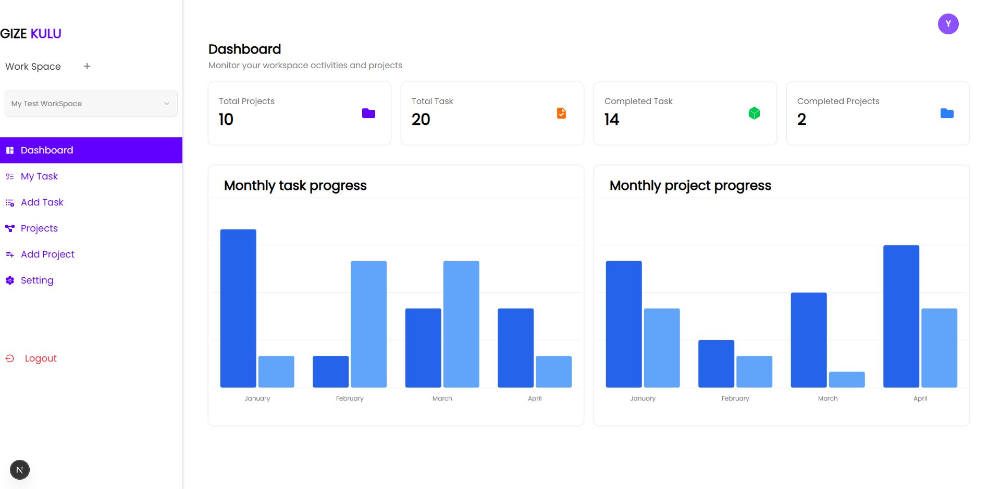

# 🚀 Gezi Kulu – Task & Project Management App

Gezi Kulu is a modern full-stack project and task management platform.  
It allows users to register, verify via email, create/manage projects and tasks, and visualize progress with clean dashboards and charts.

🔗 **Live Demo**: [https://gize-kulu.vercel.app](https://gize-kulu.vercel.app)

---

## 📸 Screenshot



---

## 🛠️ Tech Stack

- **Frontend**: Next.js 14 App Router, Tailwind CSS, shadcn/ui
- **Backend**: Next.js API Routes, Prisma ORM, MongoDB
- **Authentication**: JWT Auth (Access & Refresh), OTP Email Verification
- **Email**: NodeMailer
- **Charts**: Recharts
- **Deployment**: Vercel

---

## ✨ Features

- 🔐 OTP-based Signup + Login
- 🔄 JWT Authentication
- 📁 Create/Edit/Delete Projects
- ✅ Create/Edit/Delete Tasks per Project
- 📊 Dashboard Chart: Complete vs Incomplete by Month
- 📅 Task Due Dates, Status, Priority
- 🔒 Auth-protected Routes
- 💌 Email Notification on Login
- 📱 Fully Responsive UI

---

## ⚙️ Installation

```bash
git clone https://github.com/yohanes590/gize-kulu.git
cd gize-kulu
npm install
